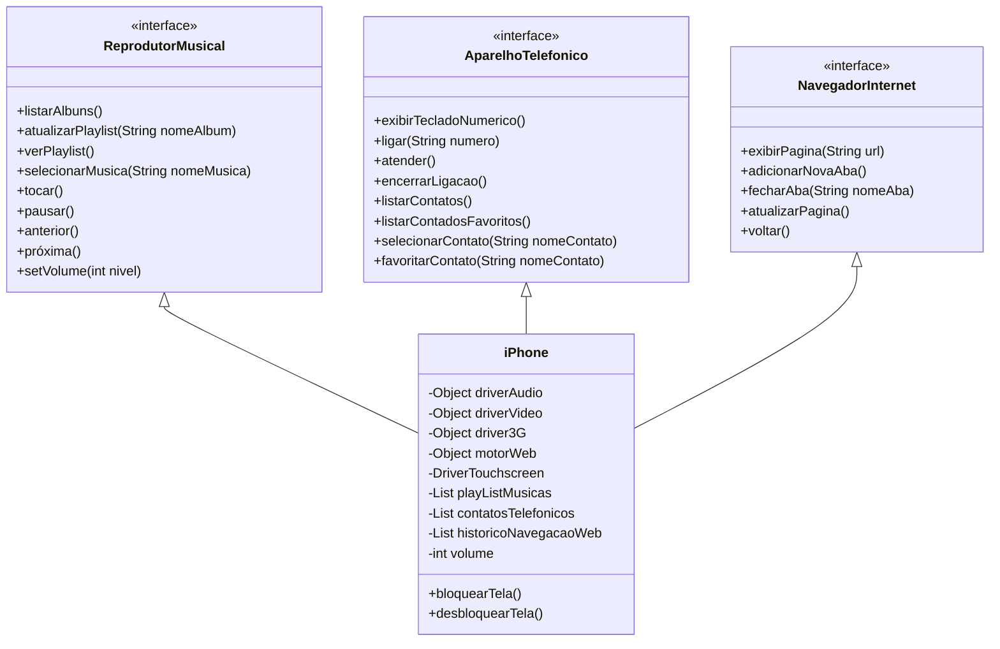

# dio-lab-diagram
Repositório do lab "Diagrama de Classes do iPhone" da Digital Innovation One.

### Diagrama UML (Mermaid)

```mermaid
classDiagram

class ReprodutorMusical {
<<interface>>
    +listarAlbuns()
    +atualizarPlaylist(String nomeAlbum)
    +verPlaylist()
    +selecionarMusica(String nomeMusica)
    +tocar()
    +pausar()
    +anterior()
    +próxima()       
    +setVolume(int nivel)
}

class AparelhoTelefonico {
<<interface>>
    +exibirTecladoNumerico()
    +ligar(String numero)
    +atender()
    +encerrarLigacao()
    +listarContatos()
    +listarContadosFavoritos()
    +selecionarContato(String nomeContato)
    +favoritarContato(String nomeContato)
}

class NavegadorInternet {
<<interface>>
    +exibirPagina(String url)
    +adicionarNovaAba()
    +fecharAba(String nomeAba)
    +atualizarPagina()
    +voltar()
}

class iPhone {
    -Object driverAudio
    -Object driverVideo
    -Object driver3G
    -Object motorWeb
    -DriverTouchscreen
    -List playListMusicas
    -List contatosTelefonicos
    -List historicoNavegacaoWeb
    -int volume
    +bloquearTela()
    +desbloquearTela()
}

    ReprodutorMusical <|-- iPhone
    AparelhoTelefonico <|-- iPhone 
    NavegadorInternet <|-- iPhone
```
